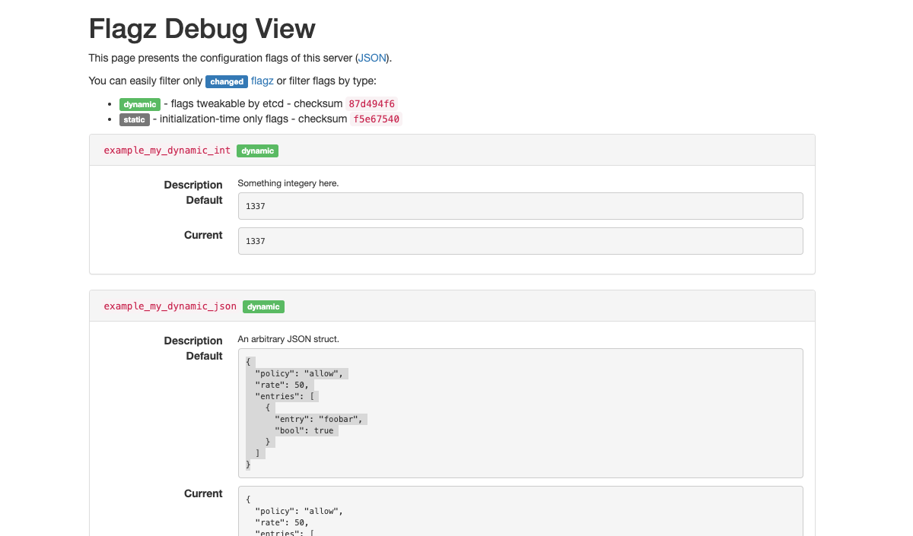

# Kubernetes ConfigMap example

- First download etcd
- initialize empty temp mapping `mkdir -p /tmp/foobar`
- run the server `go run .`
- visit the debug `http://localhost:8080/debug/flagz`

Should see this if successful:

